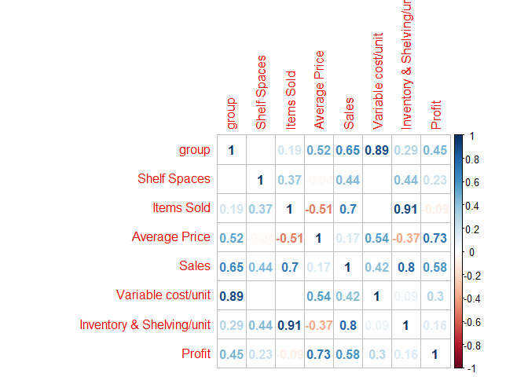

Shelf\_Space\_Allocation\_Problem\_Solution
================
Kaki
2018/4/20

Problem statement
=================

You are provided a dataset which provides sales data for three different products sold in an apparel retailer. These products are three different types of jeans sold at this retailer - Colored denim, Wide Leg, High-Rise. You are required to determine an ideal shelf allocation across these three products. The total shelf spaces available are 60. You are required to provide at least 5 shelf spaces to each product.

Problem frame
=============

Shelf space allocation problem consists of allocating the right amount of items to each product (also known as stock keeping unit - SKU) in the best position, taken into consideration the limited shelf space available on a retail store. It is a very complex problem that bears a similarity to Cutting and Packing problems, which, in general, are NP-hard.

The variety of products to be placed on shelves is usually very large, particularly in supermarkets, which are the aim of this dissertation. Solving the problem for all products would require very high computational requirements. Due to this reason, products are usually grouped into categories, depending on their functional characteristics. The problem is then solved for each category. The Shelf Space Allocation Problem may vary widely depending on the company under consideration. This happens because many factors can change from one company to another, including the dimension of stores, the preferred strategy, the agreements with vendors, the criteria used for the store’s layout, among others. But in this case, since there is no other constraints, we can consider it as a simple optimazition problem.

Problem solve sequence
======================

1.  model linear regression of space and profit, set as the objective of linear programming/optimization.
2.  Solve the linear programming and get the optimized space.

Load package
------------

``` r
library(tidyverse)
```

    ## Loading tidyverse: ggplot2
    ## Loading tidyverse: tibble
    ## Loading tidyverse: tidyr
    ## Loading tidyverse: readr
    ## Loading tidyverse: purrr
    ## Loading tidyverse: dplyr

    ## Conflicts with tidy packages ----------------------------------------------

    ## filter(): dplyr, stats
    ## lag():    dplyr, stats

``` r
library(corrplot)
```

    ## corrplot 0.84 loaded

``` r
library(stringr)
library(dplyr)
library(tidyverse)
library(lpSolve)
```

Load data
---------

``` r
retail <-read_csv('retail.csv',skip = 1,col_names = T) %>%
  select(-c(1,34,35,36))
```

    ## Warning: Duplicated column names deduplicated: 'Shelf Spaces' => 'Shelf
    ## Spaces_1' [14], 'Items Sold' => 'Items Sold_1' [15], 'Average Price'
    ## => 'Average Price_1' [16], 'Markdown' => 'Markdown_1' [17], 'Clearance'
    ## => 'Clearance_1' [18], 'Discount' => 'Discount_1' [19], 'Sales' =>
    ## 'Sales_1' [20], 'Variable cost/unit' => 'Variable cost/unit_1' [21],
    ## 'Inventory & Shelving/unit' => 'Inventory & Shelving/unit_1' [22], 'Profit'
    ## => 'Profit_1' [23], 'Shelf Spaces' => 'Shelf Spaces_2' [24], 'Items
    ## Sold' => 'Items Sold_2' [25], 'Average Price' => 'Average Price_2' [26],
    ## 'Markdown' => 'Markdown_2' [27], 'Clearance' => 'Clearance_2' [28],
    ## 'Discount' => 'Discount_2' [29], 'Sales' => 'Sales_2' [30], 'Variable
    ## cost/unit' => 'Variable cost/unit_2' [31], 'Inventory & Shelving/unit' =>
    ## 'Inventory & Shelving/unit_2' [32], 'Profit' => 'Profit_2' [33]

    ## Parsed with column specification:
    ## cols(
    ##   .default = col_character(),
    ##   `Shelf Spaces` = col_integer(),
    ##   `Items Sold` = col_number(),
    ##   Markdown = col_integer(),
    ##   Clearance = col_integer(),
    ##   Discount = col_integer(),
    ##   `Shelf Spaces_1` = col_integer(),
    ##   `Items Sold_1` = col_number(),
    ##   Markdown_1 = col_integer(),
    ##   Clearance_1 = col_integer(),
    ##   Discount_1 = col_integer(),
    ##   `Shelf Spaces_2` = col_integer(),
    ##   `Items Sold_2` = col_number(),
    ##   Markdown_2 = col_integer(),
    ##   Clearance_2 = col_integer(),
    ##   Discount_2 = col_integer()
    ## )

    ## See spec(...) for full column specifications.

``` r
retail <- retail %>%
  mutate_if(~any(str_detect(.x,pattern = "^\\(.*\\)$")),
            ~if_else(str_detect(.x,pattern = "^\\(.*\\)$"),
                     str_c("$-",str_sub(.x,3,-2)),
                     .x))  %>% 
  mutate_if(~all(str_detect(.x,pattern = "^\\$.*")), ~parse_number(.x))

all_column <- colnames(retail)[3:length(colnames(retail))]
colnames(retail)[3:12] <- str_c(all_column[1:10],"_0")
cols_to_gather <- colnames(retail)[3:length(colnames(retail))]
base_col_name <- all_column[1:10]

retail <- reshape(retail,
        direction = "long",
        varying = cols_to_gather,
        timevar = "group",
        times = c("Jeans - Colored denim","Jeans - Wide-leg","Jeans - High-rise"),
        sep = "_",
        idvar = "id") %>%
  select(-id)
```

    ## Warning: Setting row names on a tibble is deprecated.

    ## Warning: Setting row names on a tibble is deprecated.

    ## Warning: Setting row names on a tibble is deprecated.

``` r
row.names(retail) <- NULL
#
retail_selected <- retail %>%
  select_if(~ !all(unique(.x) %in% c(0,1)))
```

correlation heatmap

``` r
corrplot(cor(retail_selected %>% select_if(~is.numeric(.x))),method = "number")
```



It is clear to have following formula:

Sales = Items sold \* Average Price

Average Price ~ f(clearance, Markdown, discount)

Inventory & Shelving unit ~ g(Items sold)

Profit = Sales - Items sold \* (Variable cost/unit + Inventory cost/unit)

Thus, Profit = Average Price \* Item sold - Item sold \*(Variable cost + g(Item sold))

In order to make it linear and simplify the problem, I just make it as follows:

Profit ~ Item sold

So the problem of gain maximum profit turn into gain maximum Item sold

build linear regression model for Item sold
-------------------------------------------

``` r
retail_tib<-retail%>%
  group_by(group)%>%
  nest()%>%
  mutate(model = map(data, ~lm(`Items Sold` ~ `Shelf Spaces` + `Average Price`+0,data = .x))) %>%
  mutate(summary = map(model,summary))
retail_tib$summary
```

    ## [[1]]
    ## 
    ## Call:
    ## lm(formula = `Items Sold` ~ `Shelf Spaces` + `Average Price` + 
    ##     0, data = .x)
    ## 
    ## Residuals:
    ##     Min      1Q  Median      3Q     Max 
    ## -1614.7  -375.1   258.2   731.2  2591.0 
    ## 
    ## Coefficients:
    ##                 Estimate Std. Error t value Pr(>|t|)    
    ## `Shelf Spaces`    108.32      22.84   4.742 6.64e-05 ***
    ## `Average Price`   -33.46      16.02  -2.089   0.0466 *  
    ## ---
    ## Signif. codes:  0 '***' 0.001 '**' 0.01 '*' 0.05 '.' 0.1 ' ' 1
    ## 
    ## Residual standard error: 1204 on 26 degrees of freedom
    ## Multiple R-squared:  0.6255, Adjusted R-squared:  0.5967 
    ## F-statistic: 21.72 on 2 and 26 DF,  p-value: 2.848e-06
    ## 
    ## 
    ## [[2]]
    ## 
    ## Call:
    ## lm(formula = `Items Sold` ~ `Shelf Spaces` + `Average Price` + 
    ##     0, data = .x)
    ## 
    ## Residuals:
    ##     Min      1Q  Median      3Q     Max 
    ## -463.50 -145.81  -40.71  240.15  946.73 
    ## 
    ## Coefficients:
    ##                 Estimate Std. Error t value Pr(>|t|)    
    ## `Shelf Spaces`    54.255      7.663   7.080 1.61e-07 ***
    ## `Average Price`   -7.468      3.963  -1.884   0.0708 .  
    ## ---
    ## Signif. codes:  0 '***' 0.001 '**' 0.01 '*' 0.05 '.' 0.1 ' ' 1
    ## 
    ## Residual standard error: 350.1 on 26 degrees of freedom
    ## Multiple R-squared:  0.8788, Adjusted R-squared:  0.8695 
    ## F-statistic: 94.27 on 2 and 26 DF,  p-value: 1.217e-12
    ## 
    ## 
    ## [[3]]
    ## 
    ## Call:
    ## lm(formula = `Items Sold` ~ `Shelf Spaces` + `Average Price` + 
    ##     0, data = .x)
    ## 
    ## Residuals:
    ##     Min      1Q  Median      3Q     Max 
    ## -1355.7  -334.0   337.0   479.4  2234.2 
    ## 
    ## Coefficients:
    ##                 Estimate Std. Error t value Pr(>|t|)    
    ## `Shelf Spaces`   114.632     14.726   7.784 2.94e-08 ***
    ## `Average Price`  -10.550      6.816  -1.548    0.134    
    ## ---
    ## Signif. codes:  0 '***' 0.001 '**' 0.01 '*' 0.05 '.' 0.1 ' ' 1
    ## 
    ## Residual standard error: 823.8 on 26 degrees of freedom
    ## Multiple R-squared:  0.8689, Adjusted R-squared:  0.8588 
    ## F-statistic: 86.13 on 2 and 26 DF,  p-value: 3.392e-12

Frame linear optimization
-------------------------

define space, price for Colored denim jeans to be S1, P1; for Wide-leg to be S2, P2; for High-rise to be S3, P3

Item solds = 108.32S1 -33.46P1 + 54.253S2 -7.468P2 + 114.632S3 -10.55P3

target: max Item solds

contraint : S1 &gt;=5 ; S2 &gt;= 5, S3 &gt;=5, S1 + S2 +S3 &lt;= 60 16 &lt;= P1 &lt;= 40 19 &lt;= P2 &lt;= 48 22 &lt;= P3 &lt;= 55

Model:

``` r
constraint.matrix <- matrix(c(1,0,0,0,0,0,
                              0,1,0,0,0,0,
                              0,0,1,0,0,0,
                              1,1,1,0,0,0,
                              0,0,0,1,0,0,
                              0,0,0,0,1,0,
                              0,0,0,0,0,1,
                              0,0,0,1,0,0,
                              0,0,0,0,1,0,
                              0,0,0,0,0,1),nrow = 10,byrow = T)

constraint.rhs <- c(5,5,5,60,16,19,22,40,48,55)

retail_lp<-lp(direction = "max",
   objective.in = c(108.32, -33.46, 54.253, -7.468, 114.632, -10.55),
   const.mat = constraint.matrix,
   const.dir = c(">=",">=", ">=","<=", ">=",">=", ">=", "<=","<=","<="),
   const.rhs = constraint.rhs
   )
retail_lp$solution
```

    ## [1] 50  5  5 16 48 22

``` r
retail_lp
```

    ## Success: the objective function is 10670.71

Solution
========

Allocate 50 shelf space to Colored denim jeans, 5 to Wide-leg jeans and High-rise jeans, respectively will gain maximun Item sold : 10670 jeans.
